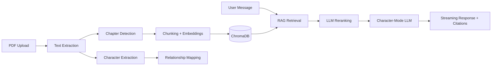
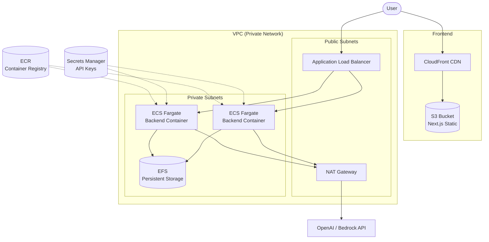

<p align="center">
  
</p>

<h1 align="center">DepthOfInk</h1>

<p align="center">
  <strong>Upload a storybook PDF. Chat with its characters. Every reply grounded in the text.</strong>
</p>

<p align="center">
  
  
  
  
  
  
  
  
</p>

<p align="center">
  <a href="#features">Features</a> •
  <a href="#how-it-works">How It Works</a> •
  <a href="#quick-start">Quick Start</a> •
  <a href="#llm-providers">LLM Providers</a> •
  <a href="#production-hardening">Production Hardening</a> •
  <a href="#deployment">Deployment</a> •
  <a href="#testing">Testing</a> •
  <a href="#project-layout">Project Layout</a> •
  <a href="#roadmap">Roadmap</a>
</p>

---

<!-- Uncomment once you've added a demo recording:
<p align="center">
  
</p>
-->

## Features

| Feature | Description |
|---------|-------------|
| 📄 **Smart PDF Parsing** | Chapter detection, layout-aware text extraction (PyMuPDF + pdfplumber fallback) |
| 🎭 **Auto Character Extraction** | Two-pass LLM analysis: broad recall across multiple excerpts → ranked merge, up to 20 characters |
| 🔍 **Chapter-Aware RAG** | Chunking with chapter metadata, embeddings in ChromaDB, LLM reranking for high-precision retrieval |
| 💬 **In-Character Chat** | Streaming responses grounded in book text with page-level citations |
| 👥 **Group Chat** | Multi-character conversations where each character responds in turn |
| 🧠 **Per-Character Memory** | Conversation summaries persist across sessions via automatic summarization |
| 🕸️ **Relationship Graph** | Auto-extracted character relationships with interactive visual graph |
| 🔄 **Multi-Provider LLM** | Switch between OpenAI, AWS Bedrock, or Ollama with a single env var |
| 🛡️ **Production Hardened** | Rate limiting, CORS lockdown, input sanitization, structured JSON logging, upload concurrency control |
| 🏗️ **AWS-Ready** | Terraform modules for ECS Fargate + S3/CloudFront + EFS + ALB deployment |

---

## How It Works



1. **Upload** — Drop a PDF. Text is extracted, chapters are detected, and chunks are embedded into ChromaDB.
2. **Discover** — Characters are auto-extracted via two-pass LLM analysis (broad extract → ranked merge). Relationships between characters are mapped.
3. **Chat** — Ask a question. RAG retrieves relevant passages, an LLM reranks them for precision, and the character responds in their voice.
4. **Cite** — Every response includes page-level citations linking back to the source text.

---

## Quick Start

### Prerequisites

- Python 3.12+ and Node.js 18+
- An OpenAI API key (or AWS credentials for Bedrock, or [Ollama](https://ollama.com) running locally)

### 1. Backend

```bash
cd backend
python3 -m venv .venv
source .venv/bin/activate   # Windows: .venv\Scripts\activate
pip install -r requirements.txt
cp .env.example .env        # edit .env and set OPENAI_API_KEY=sk-...
```

Start the server:

```bash
uvicorn app.main:app --reload --host 0.0.0.0 --port 8000
```

> **Tip:** If `uvicorn: command not found`, make sure the venv is active. Verify with `which uvicorn`.

### 2. Frontend

```bash
cd frontend
npm install
cp .env.local.example .env.local   # optional; defaults to http://localhost:8000
npm run dev
```

Open [http://localhost:3000](http://localhost:3000), upload a story PDF, pick a character, and start chatting.

### 3. Docker (Backend)

```bash
cd backend
docker build -t depthofink-backend .
docker run -p 8000:8000 -e OPENAI_API_KEY=sk-... depthofink-backend
```

---

## LLM Providers

The backend supports multiple LLM providers via the `LLM_PROVIDER` env var:

<details>
<summary><strong>OpenAI (default)</strong></summary>

```env
LLM_PROVIDER=openai
OPENAI_API_KEY=sk-...
CHAT_MODEL=gpt-4o-mini
EMBEDDING_MODEL=text-embedding-3-small
```

</details>

<details>
<summary><strong>AWS Bedrock</strong></summary>

```env
LLM_PROVIDER=bedrock
AWS_REGION=us-east-1
CHAT_MODEL=us.anthropic.claude-3-5-haiku-20241022-v1:0
EMBEDDING_MODEL=amazon.titan-embed-text-v2:0
```

Requires AWS credentials via `~/.aws/credentials`, env vars, or an IAM role.

</details>

<details>
<summary><strong>Ollama (local, free)</strong></summary>

```env
LLM_PROVIDER=openai
OPENAI_BASE_URL=http://localhost:11434/v1
OPENAI_API_KEY=unused
CHAT_MODEL=llama3
EMBEDDING_MODEL=nomic-embed-text
```

Requires [Ollama](https://ollama.com) running locally with models pulled.

</details>

---

## Production Hardening

| Layer | Implementation |
|-------|---------------|
| **Rate limiting** | Per-endpoint limits via slowapi — uploads: 5/hr, chat: 30/min, reads: 60/min |
| **File validation** | PDF magic bytes verification, 50 MB size limit enforced client-side and server-side |
| **CORS lockdown** | Configurable allowed origins via `CORS_ORIGINS` env var |
| **Input sanitization** | Message length limits (5K chars), history entry limits (10K chars) |
| **Concurrent uploads** | Asyncio semaphore caps parallel processing (default: 3 concurrent) |
| **Structured logging** | JSON logs with per-request ID correlation (`LOG_FORMAT=json`) |
| **Health checks** | `/health` probes ChromaDB heartbeat + filesystem writability, returns 503 on failure |
| **Delete & retry** | Full book cleanup (PDF, embeddings, conversations) + retry for failed processing |
| **CI** | GitHub Actions runs 174 backend tests + frontend TypeScript check + build on every push |

---

## Deployment

### AWS Architecture



### Terraform Modules

The `infra/` directory contains modular Terraform for the full deployment:

| Module | Resources |
|--------|-----------|
| **networking** | VPC, public/private subnets, NAT Gateway, ALB, security groups |
| **ecr** | Container registry for backend Docker images |
| **secrets** | AWS Secrets Manager for API keys |
| **ecs** | ECS Fargate service, task definition, auto-scaling, EFS for persistent data |
| **frontend** | S3 + CloudFront for static Next.js export |

```bash
cd infra
terraform init
terraform plan
terraform apply
```

See `infra/variables.tf` for all configurable options (instance size, scaling limits, region, etc.).

---

## Testing

```bash
cd backend
source .venv/bin/activate
python -m pytest tests/ -v
```

**174 tests** covering:

| Area | What's tested |
|------|---------------|
| API endpoints | Books CRUD, upload validation, delete, retry, character listing, chat routing |
| Schemas | Pydantic model validation, input sanitization limits, field constraints |
| Book store | Save/load/delete, status transitions, conversation cleanup |
| PDF service | Text cleaning, chunking, page assignment, chapter detection |
| Character service | Extraction helpers, sampling strategies, relationship schemas |
| Chat service | System prompt construction, context formatting, memory integration |
| Group chat | Multi-character prompt building, schema validation |
| Memory | Conversation store, memory summaries, isolation between characters |
| Logging | JSON formatter, request ID filter, middleware propagation |
| Security | CORS enforcement, rate limiting, file size/type validation, concurrent upload limits |

---

## Project Layout

```
DepthOfInk/
├── backend/
│   ├── app/
│   │   ├── api/routes/         # books, characters, chat endpoints
│   │   ├── models/             # Pydantic schemas
│   │   ├── services/           # pdf, characters, rag, chat, memory, llm_provider
│   │   ├── config.py           # All settings from env vars
│   │   ├── main.py             # FastAPI app, middleware, health check
│   │   ├── logging_config.py   # Structured JSON logging + request ID
│   │   └── rate_limit.py       # slowapi limiter singleton
│   ├── tests/                  # 174 pytest tests
│   ├── Dockerfile              # Multi-stage production build
│   ├── requirements.txt
│   └── .env.example
├── frontend/
│   ├── app/
│   │   ├── page.tsx            # Home: upload, book list, delete/retry
│   │   └── book/[id]/          # Chat UI, character tabs, relationship graph
│   │       └── components/     # ChatBubble, CharacterTabs, RelationshipGraph
│   ├── lib/api.ts              # Typed API client
│   └── package.json
├── infra/                      # Terraform (AWS ECS Fargate + S3/CloudFront)
│   ├── main.tf
│   ├── variables.tf
│   └── modules/                # networking, ecr, ecs, secrets, frontend
├── .github/workflows/ci.yml   # CI: backend tests + frontend build
├── ROADMAP.md
├── LICENSE                     # MIT
└── README.md
```

---

## Configuration Reference

All settings are configurable via environment variables in `backend/.env`:

| Variable | Default | Description |
|----------|---------|-------------|
| `LLM_PROVIDER` | `openai` | LLM backend: `openai` or `bedrock` |
| `OPENAI_API_KEY` | — | OpenAI API key |
| `OPENAI_BASE_URL` | — | Override for Ollama or compatible APIs |
| `CHAT_MODEL` | `gpt-4o-mini` | Chat completion model |
| `EMBEDDING_MODEL` | `text-embedding-3-small` | Embedding model |
| `MAX_CHARACTERS` | `20` | Max characters to extract per book |
| `CHARS_PER_SAMPLE` | `12000` | Excerpt size for character extraction |
| `CHUNK_SIZE` | `800` | RAG chunk size in characters |
| `CHUNK_OVERLAP` | `150` | Overlap between chunks |
| `RERANK_ENABLED` | `true` | Enable LLM reranking of retrieved passages |
| `MAX_UPLOAD_SIZE_MB` | `50` | Maximum PDF upload size |
| `MAX_CONCURRENT_UPLOADS` | `3` | Concurrent upload/processing limit |
| `CORS_ORIGINS` | `http://localhost:3000` | Comma-separated allowed origins |
| `LOG_FORMAT` | `text` | `text` for dev, `json` for production |
| `LOG_LEVEL` | `INFO` | Logging verbosity |
| `RATE_LIMIT_ENABLED` | `true` | Toggle rate limiting (disable for dev) |
| `RATE_LIMIT_UPLOAD` | `5/hour` | Upload endpoint rate limit |
| `RATE_LIMIT_CHAT` | `30/minute` | Chat endpoint rate limit |

---

## Roadmap

### Completed

- [x] PDF ingestion with chapter detection
- [x] Two-pass character extraction (up to 20 characters)
- [x] Chapter-aware RAG with LLM reranking
- [x] Streaming in-character chat with citations
- [x] Per-character conversation memory
- [x] Multi-character group chat
- [x] Character relationship graph
- [x] Multi-provider LLM support (OpenAI / Bedrock / Ollama)
- [x] Production hardening (rate limiting, CORS, validation, logging, concurrency)
- [x] CI pipeline (GitHub Actions)
- [x] AWS deployment (Terraform)

### In Progress

- [ ] Staged progress indicator during PDF processing
- [ ] Export conversations as text/JSON
- [ ] Evaluation harness for character fidelity
- [ ] Mobile-optimized upload experience

### Future

- [ ] Voice / TTS for character dialogue
- [ ] Public gallery of sample books (public domain)
- [ ] Per-user API key management / quotas
- [ ] Database backend (replace JSON files with SQLite/Postgres)

See [ROADMAP.md](./ROADMAP.md) for the full breakdown.

---

## Contributing

1. Fork the repo
2. Create a feature branch (`git checkout -b feature/my-feature`)
3. Run tests (`cd backend && python -m pytest tests/ -v`)
4. Open a PR

---

## License

[MIT](./LICENSE) — Hariharan Ragothaman
